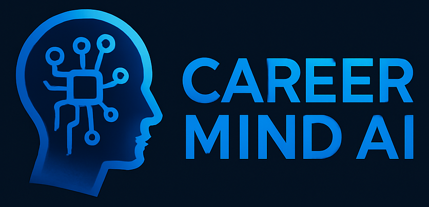

# CareerMind AI 🎯💼

**CareerMind AI** is a cutting-edge Full Stack AI Career Coach built with the latest web technologies. Designed to offer personalized, AI-powered career guidance, this project is ideal for showcasing advanced full stack development skills on your resume.

> 🚀 Built using React 19, Next.js 15, Tailwind CSS, NeonDB, Prisma, Clerk, Inngest, Shadcn UI, and the Gemini 1.5 API.

---

<p align="center">
  
</p>

## 🧠 What It Does

CareerMind AI provides users with tailored support across various stages of their career journey:

- 🔍 **Industry Insights** — Get real-time, AI-curated updates on industry trends and in-demand skills.
- 🎯 **Targeted Interview Coaching** — Practice interviews with AI-generated, role-specific questions and feedback.
- ✍️ **Cover Letter Generator** — Instantly craft compelling cover letters using the power of AI.
- 📚 **Interview Preparation** — Get detailed guidance and practice resources based on your job target.
- 🤖 **AI-Driven Career Support** — Personalized career paths, resume tips, and growth strategies.

---

## ⚙️ Tech Stack

| Frontend        | Backend          | Auth & Infra       | AI & Automation    |
|-----------------|------------------|---------------------|---------------------|
| ✅ React 19      | ✅ Next.js 15     | ✅ Clerk             | ✅ Gemini 1.5 API    |
| ✅ Tailwind CSS  | ✅ Prisma ORM     | ✅ NeonDB (Postgres) | ✅ Inngest (CRON + Jobs) |
| ✅ Shadcn UI     | ✅ Zod Validation |                     |                     |

---


## 🚀 Getting Started

Clone the repo and install dependencies:

```bash
git clone https://github.com/dev-SachinPrajapati/CareerMind-AI.git
cd CareerMind-AI
npm install
